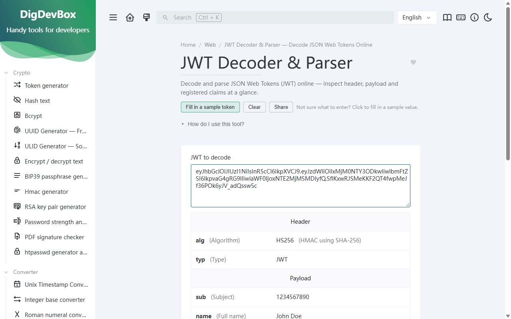
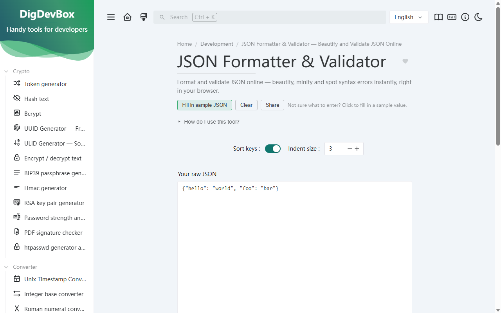
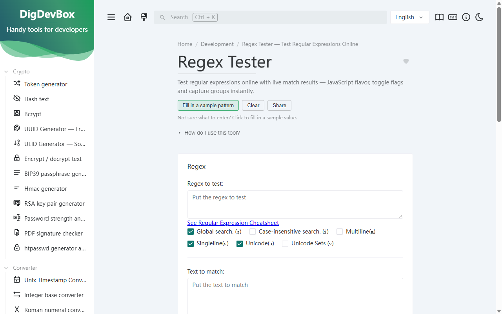

# DigDevBox — Developer Tools

**DigDevBox** is a collection of 101 free online tools for developers and DevOps — JSON, JWT, regex, UUID, network and more. Tools run locally in your browser by default; a few require a network query.

| | |
| --- | --- |
| **Website** | <https://digdevbox.com> |
| **Blog** | <https://notes.digdevbox.com> |
| **Source code** | <https://github.com/yqh-core/dev-tools> |

<p>
  
</p>

## Screenshots

| | | |
| :---: | :---: | :---: |
|  |  |  |
| JWT Decoder & Parser | JSON Formatter & Validator | Regex Tester |

## Why DigDevBox

- **101 utilities across 10 categories** — see the full list below
- **No signup, no installation** — open a page and use the tool
- **Local-first** — most tools process data entirely in your browser; nothing is uploaded (a few tools, e.g. WHOIS lookup and HTTP status checker, query a backend API and are labeled as such)
- **Open source** — GPLv3, self-hostable as a static site

## All tools (101)

<!-- generated-tools-list:start -->
### Crypto

- [Token generator](https://digdevbox.com/token-generator) - Generate random string with the chars you want, uppercase or lowercase letters, numbers and/or symbols.
- [Hash text](https://digdevbox.com/hash-text) - Hash a text string using the function you need : MD5, SHA1, SHA256, SHA224, SHA512, SHA384, SHA3 or RIPEMD160
- [Bcrypt](https://digdevbox.com/bcrypt) - Hash and compare text string using bcrypt. Bcrypt is a password-hashing function based on the Blowfish cipher.
- [UUID Generator — Free Online UUID v4 Generator](https://digdevbox.com/uuid-generator) - Generate UUIDs online for free — v4 random, v1 time-based, v3/v5 namespace UUIDs and NIL, with one-click copy.
- [ULID Generator — Sortable, Time-Ordered IDs Online](https://digdevbox.com/ulid-generator) - Generate ULIDs online — sortable, time-ordered unique identifiers, ideal for database keys and distributed systems.
- [Encrypt / decrypt text](https://digdevbox.com/encryption) - Encrypt clear text and decrypt ciphertext using crypto algorithms like AES, TripleDES, Rabbit or RC4.
- [BIP39 passphrase generator](https://digdevbox.com/bip39-generator) - Generate a BIP39 passphrase from an existing or random mnemonic, or get the mnemonic from the passphrase.
- [Hmac generator](https://digdevbox.com/hmac-generator) - Computes a hash-based message authentication code (HMAC) using a secret key and your favorite hashing function.
- [RSA key pair generator](https://digdevbox.com/rsa-key-pair-generator) - Generate a new random RSA private and public pem certificate key pair.
- [Password strength analyser](https://digdevbox.com/password-strength-analyser) - Discover the strength of your password with this client-side-only password strength analyser and crack time estimation tool.
- [PDF signature checker](https://digdevbox.com/pdf-signature-checker) - Verify the signatures of a PDF file. A signed PDF file contains one or more signatures that may be used to determine whether the contents of the file have been altered since the file was signed.
- [htpasswd generator and checker](https://digdevbox.com/htpasswd-generator) - Generate .htpasswd lines for Apache or Nginx basic auth using bcrypt, apr1, SHA1 or plain text, and verify existing entries.

### Converter

- [Unix Timestamp Converter — Epoch to Date & Time Online](https://digdevbox.com/date-converter) - Convert Unix timestamps to human-readable dates and back — epoch time, ISO 8601, UTC and local time zones.
- [Integer base converter](https://digdevbox.com/base-converter) - Convert a number between different bases (decimal, hexadecimal, binary, octal, base64, ...)
- [Roman numeral converter](https://digdevbox.com/roman-numeral-converter) - Convert Roman numerals to numbers and convert numbers to Roman numerals.
- [Base64 string encoder/decoder](https://digdevbox.com/base64-string-converter) - Simply encode and decode strings into their base64 representation.
- [Base64 file converter](https://digdevbox.com/base64-file-converter) - Convert a string, file, or image into its base64 representation.
- [Color converter](https://digdevbox.com/color-converter) - Convert color between the different formats (hex, rgb, hsl and css name)
- [Case converter](https://digdevbox.com/case-converter) - Transform the case of a string and choose between different formats
- [Text to NATO alphabet](https://digdevbox.com/text-to-nato-alphabet) - Transform text into the NATO phonetic alphabet for oral transmission.
- [Text to ASCII binary](https://digdevbox.com/text-to-binary) - Convert text to its ASCII binary representation and vice-versa.
- [Text to Unicode](https://digdevbox.com/text-to-unicode) - Parse and convert text to unicode and vice-versa
- [YAML to JSON converter](https://digdevbox.com/yaml-to-json-converter) - Simply convert YAML to JSON with this online live converter.
- [YAML to TOML](https://digdevbox.com/yaml-to-toml) - Parse and convert YAML to TOML.
- [JSON to YAML converter](https://digdevbox.com/json-to-yaml-converter) - Simply convert JSON to YAML with this online live converter.
- [JSON to TOML](https://digdevbox.com/json-to-toml) - Parse and convert JSON to TOML.
- [List converter](https://digdevbox.com/list-converter) - This tool can process column-based data and apply various changes (transpose, add prefix and suffix, reverse list, sort list, lowercase values, truncate values) to each row.
- [TOML to JSON](https://digdevbox.com/toml-to-json) - Parse and convert TOML to JSON.
- [TOML to YAML](https://digdevbox.com/toml-to-yaml) - Parse and convert TOML to YAML.
- [XML to JSON](https://digdevbox.com/xml-to-json) - Convert XML data to JSON format.
- [JSON to XML](https://digdevbox.com/json-to-xml) - Convert JSON data to XML format.
- [Markdown to HTML](https://digdevbox.com/markdown-to-html) - Convert Markdown to HTML, with print support (save as PDF).
- [RMB amount in Chinese uppercase](https://digdevbox.com/rmb-uppercase) - Turn a numeric amount into the Chinese financial uppercase wording (yuan / jiao / fen), with an optional RMB prefix.
- [ASCII table](https://digdevbox.com/ascii-table) - The standard ASCII table from 0 to 127 with decimal, hexadecimal, octal and binary values, searchable by character or code.

### Web

- [Encode/decode URL-formatted strings](https://digdevbox.com/url-encoder) - Encode text to URL-encoded format (also known as "percent-encoded"), or decode from it.
- [Escape HTML entities](https://digdevbox.com/html-entities) - Escape or unescape HTML entities (replace characters like <,>, &, " and \' with their HTML version)
- [URL parser](https://digdevbox.com/url-parser) - Parse a URL into its separate constituent parts (protocol, origin, params, port, username-password, ...)
- [Device information](https://digdevbox.com/device-information) - Get information about your current device (screen size, pixel-ratio, user agent, ...)
- [Basic auth generator](https://digdevbox.com/basic-auth-generator) - Generate a base64 basic auth header from a username and password.
- [Open graph meta generator](https://digdevbox.com/og-meta-generator) - Generate open-graph and socials HTML meta tags for your website.
- [OTP code generator](https://digdevbox.com/otp-generator) - Generate and validate time-based OTP (one time password) for multi-factor authentication.
- [MIME types](https://digdevbox.com/mime-types) - Convert MIME types to file extensions and vice-versa.
- [JWT Decoder & Parser — Decode JSON Web Tokens Online](https://digdevbox.com/jwt-parser) - Decode and parse JSON Web Tokens (JWT) online — inspect header, payload and registered claims at a glance.
- [Keycode info](https://digdevbox.com/keycode-info) - Find the javascript keycode, code, location and modifiers of any pressed key.
- [Slugify string](https://digdevbox.com/slugify-string) - Make a string url, filename and id safe.
- [HTML WYSIWYG editor](https://digdevbox.com/html-wysiwyg-editor) - Online, feature-rich WYSIWYG HTML editor which generates the source code of the content immediately.
- [User-agent parser](https://digdevbox.com/user-agent-parser) - Detect and parse Browser, Engine, OS, CPU, and Device type/model from an user-agent string.
- [HTTP status codes](https://digdevbox.com/http-status-codes) - The list of all HTTP status codes, their name, and their meaning.
- [JSON diff](https://digdevbox.com/json-diff) - Compare two JSON objects and get the differences between them.
- [Outlook SafeLink Decoder](https://digdevbox.com/safelink-decoder) - Decode SafeLink URLs from Outlook emails and recover the real address.
- [JSON to GET params](https://digdevbox.com/json-to-get-params) - Flatten JSON into a URL query string (a[b][0]=1 style) and rebuild JSON from a query string or a full URL.
- [HTTP headers reference](https://digdevbox.com/http-headers) - A searchable reference of common HTTP request and response headers, covering CORS, caching and security fields.

### Images and videos

- [QR Code generator](https://digdevbox.com/qrcode-generator) - Generate and download a QR code for a URL (or just plain text), and customize the background and foreground colors.
- [WiFi QR Code generator](https://digdevbox.com/wifi-qrcode-generator) - Generate and download QR codes for quick connections to WiFi networks.
- [SVG placeholder generator](https://digdevbox.com/svg-placeholder-generator) - Generate svg images to use as a placeholder in your applications.
- [Camera recorder](https://digdevbox.com/camera-recorder) - Take a picture or record a video from your webcam or camera.

### Development

- [Git cheatsheet](https://digdevbox.com/git-memo) - Git is a decentralized version management software. With this cheatsheet, you will have quick access to the most common git commands.
- [Random port generator](https://digdevbox.com/random-port-generator) - Generate random port numbers outside of the range of "known" ports (0-1023).
- [Crontab generator](https://digdevbox.com/crontab-generator) - Validate and generate crontab and get the human-readable description of the cron schedule.
- [JSON Formatter & Validator — Beautify and Validate JSON Online](https://digdevbox.com/json-prettify) - Format and validate JSON online — beautify, minify and spot syntax errors instantly, right in your browser.
- [JSON minify](https://digdevbox.com/json-minify) - Minify and compress your JSON by removing unnecessary whitespace.
- [JSON to CSV](https://digdevbox.com/json-to-csv) - Convert JSON to CSV with automatic header detection.
- [SQL prettify and format](https://digdevbox.com/sql-prettify) - Format and prettify your SQL queries online (it supports various SQL dialects).
- [Chmod calculator](https://digdevbox.com/chmod-calculator) - Compute your chmod permissions and commands with this online chmod calculator.
- [Docker run to Docker compose converter](https://digdevbox.com/docker-run-to-docker-compose-converter) - Transforms "docker run" commands into docker-compose files!
- [XML formatter](https://digdevbox.com/xml-formatter) - Prettify your XML string into a friendly, human-readable format.
- [YAML prettify and format](https://digdevbox.com/yaml-prettify) - Prettify your YAML string into a friendly, human-readable format.
- [Email Address Normalizer](https://digdevbox.com/email-normalizer) - Normalize email addresses to a standard format for easier comparison, deduplication and data cleaning.
- [Regex Tester — Test Regular Expressions Online](https://digdevbox.com/regex-tester) - Test regular expressions online with live match results — JavaScript flavor, toggle flags and capture groups instantly.
- [Regex Cheat Sheet — Complete Regular Expression Reference](https://digdevbox.com/regex-memo) - A complete regex cheat sheet — common regular expression syntax, quantifiers, flags and character classes with examples.
- [px / rem converter](https://digdevbox.com/px-rem-converter) - Convert a batch of values between px and rem with a configurable root font size.
- [JSON to model classes](https://digdevbox.com/json-to-code) - Generate TypeScript, C#, Java or Go model classes from JSON, splitting nested objects into their own classes.
- [Linux commands cheat sheet](https://digdevbox.com/linux-commands) - A searchable cheat sheet of common Linux commands with what they do and ready-to-use examples.

### Network

- [IPv4 subnet calculator](https://digdevbox.com/ipv4-subnet-calculator) - Parse your IPv4 CIDR blocks and get all the info you need about your subnet.
- [IPv4 address converter](https://digdevbox.com/ipv4-address-converter) - Convert an IP address into decimal, binary, hexadecimal, or even an IPv6 representation of it.
- [IPv4 range expander](https://digdevbox.com/ipv4-range-expander) - Given a start and an end IPv4 address, this tool calculates a valid IPv4 subnet along with its CIDR notation.
- [MAC address lookup](https://digdevbox.com/mac-address-lookup) - Find the vendor and manufacturer of a device by its MAC address.
- [MAC address generator](https://digdevbox.com/mac-address-generator) - Enter the quantity and prefix. MAC addresses will be generated in your chosen case (uppercase or lowercase)
- [IPv6 ULA generator](https://digdevbox.com/ipv6-ula-generator) - Generate your own local, non-routable IP addresses for your network according to RFC4193.
- [WHOIS lookup](https://digdevbox.com/whois-lookup) - Look up domain registration data such as registrar, dates and status. Powered by RDAP, the official successor of WHOIS.
- [HTTP status checker](https://digdevbox.com/http-status-checker) - Check the live HTTP status code and response headers of a URL to troubleshoot reachability, redirects and caching.
- [Today in history](https://digdevbox.com/today-in-history) - See what happened on this day in history. Events load automatically when the page opens.

### Math

- [Math evaluator](https://digdevbox.com/math-evaluator) - A calculator for evaluating mathematical expressions. You can use functions like sqrt, cos, sin, abs, etc.
- [ETA calculator](https://digdevbox.com/eta-calculator) - An ETA (Estimated Time of Arrival) calculator to determine the approximate end time of a task, for example, the end time and duration of a file download.
- [Percentage calculator](https://digdevbox.com/percentage-calculator) - Easily calculate percentages from a value to another value, or from a percentage to a value.

### Measurement

- [Chronometer](https://digdevbox.com/chronometer) - Monitor the duration of a thing. Basically a chronometer with simple chronometer features.
- [Temperature converter](https://digdevbox.com/temperature-converter) - Degrees temperature conversions for Kelvin, Celsius, Fahrenheit, Rankine, Delisle, Newton, Réaumur, and Rømer.
- [Unit converter](https://digdevbox.com/unit-converter) - Convert between 11 categories of units: length, area, volume, weight, speed, time, data storage, power, pressure, angle and temperature.
- [Benchmark builder](https://digdevbox.com/benchmark-builder) - Easily compare execution time of tasks with this very simple online benchmark builder.

### Text

- [Lorem ipsum generator](https://digdevbox.com/lorem-ipsum-generator) - Lorem ipsum is a placeholder text commonly used to demonstrate the visual form of a document or a typeface without relying on meaningful content
- [Text statistics](https://digdevbox.com/text-statistics) - Get information about a text, the number of characters, the number of words, its size in bytes, ...
- [Emoji picker](https://digdevbox.com/emoji-picker) - Copy and paste emojis easily and get the unicode and code points value of each emoji.
- [String obfuscator](https://digdevbox.com/string-obfuscator) - Obfuscate a string (like a secret, an IBAN, or a token) to make it shareable and identifiable without revealing its content.
- [Text diff](https://digdevbox.com/text-diff) - Compare two texts and see the differences between them.
- [Numeronym generator](https://digdevbox.com/numeronym-generator) - A numeronym is a word where a number is used to form an abbreviation. For example, "i18n" is a numeronym of "internationalization" where 18 stands for the number of letters between the first i and the last n in the word.
- [ASCII Art Generator](https://digdevbox.com/ascii-text-drawer) - Turn text into ASCII art with multiple fonts and styles.
- [Full-width / half-width converter](https://digdevbox.com/fullwidth-converter) - Convert between full-width and half-width characters using the fixed Unicode offset 0xFEE0, or adjust punctuation only.
- [Morse code converter](https://digdevbox.com/morse-code-converter) - Encode text into Morse code and decode it back. Letters are separated by spaces and words by a slash.
- [Batch text replacer](https://digdevbox.com/text-replacer) - Find and replace text with plain or regular-expression matching, optional case-insensitive mode and a match counter.

### Data

- [Phone parser and formatter](https://digdevbox.com/phone-parser-and-formatter) - Parse, validate and format phone numbers. Get information about the phone number, like the country code, type, etc.
- [IBAN validator and parser](https://digdevbox.com/iban-validator-and-parser) - Validate and parse IBAN numbers. Check if an IBAN is valid and get the country, BBAN, if it is a QR-IBAN and the IBAN friendly format.
<!-- generated-tools-list:end -->

## Differences from upstream [it-tools](https://github.com/CorentinTh/it-tools)

This project is built on top of [it-tools](https://github.com/CorentinTh/it-tools) (GPL-3.0) and stays GPL-3.0. Compared with upstream:

- Rebranded as **DigDevBox** (sidebar, command palette, about page, SEO metadata)
- Attribution preserved: the about page states the upstream origin and license
- Added tools for Chinese-language scenarios and DevOps workflows (RMB uppercase, fullwidth converter, px↔rem, Morse code, WHOIS lookup, HTTP status checker, htpasswd, Linux commands cheat sheet, ASCII table, and more)
- SEO infrastructure: static pre-rendering for all tool pages, sitemap, per-tool landing content, multilingual keywords
- Removed upstream sponsorship links and external social accounts

## Development

```sh
npm install pnpm -g    # once
pnpm install
pnpm dev               # dev server
pnpm build             # production build (pre-rendered + sitemap)
```

### Deploy (nginx)

```nginx
server {
    listen 80;
    server_name localhost;
    root /usr/share/nginx/html;
    index index.html;

    location / {
        try_files $uri $uri/ /index.html;
    }
}
```

> 运行环境需要 Node.js（<https://nodejs.org/zh-cn/download>）。
> 浏览器调试时可临时关闭 Service Worker：DevTools → Application → Service Workers → Unregister。

## License

GPL-3.0. Upstream [it-tools](https://github.com/CorentinTh/it-tools) by Corentin Th — thank you.
